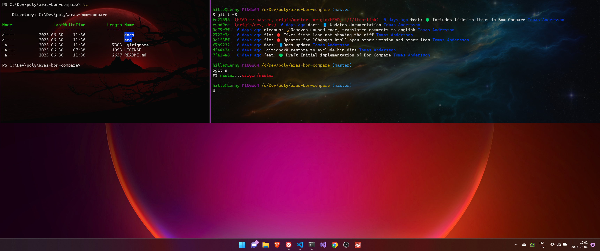

# Configuring the Terminal

As I daily use the (windows) terminal for various reasons I will describe my preferred setup.  
NOTE: The keybindings I have setup refers to the default SE keyboard layout. And I am using a 34" widescreen.



## Quake mode

I have the keybinding for toggle the `Quake window` to `Ctrl+§` ([Image of quake window](https://static1.makeuseofimages.com/wordpress/wp-content/uploads/2023/02/windows-terminal-quake.jpg))  
This to get to a terminal without any "alt-tabbing", which kan be a nuisance when having more than two applications running.

Configured via Setting UI, which corresponds to the following

``` json
actions:
    [
        ...
        {
            "command": 
            {
                "action": "quakeMode"
            },
            "keys": "ctrl+\u00a7"
        }
    ]
```

## Add Git Bash

After installing git I can add the git-bash to terminal:  
<https://www.commandlinewizardry.com/post/how-to-add-git-bash-to-windows-terminal>

## Configuring the multi pane

I have the cross platform powershell as the default terminal, which I usually run in quake mode.
I have configured `Ctrl+G` to open a new split pane (vertical) git bash

``` json
"actions": 
    [
        { "keys": ["ctrl+g"], "command": { "action": "splitPane", "split": "vertical", "profile": "Git Bash" } },
    ...
    // Other configurations
```

## Backgrounds

And some image backgrounds.

``` json
    ...
    "tabTitle": "Git Bash",
    "backgroundImage": "https://eskipaper.com/images/cool-space-wallpaper-4.jpg",
    "backgroundImageOpacity": 0.3
    ...
```

## References

1. <https://endjin.com/blog/2020/05/5-tips-for-an-awesome-windows-terminal-experience>
2. [Add support for new panes with specifc profiles and other settings overrides #3825](https://github.com/microsoft/terminal/pull/3825)
